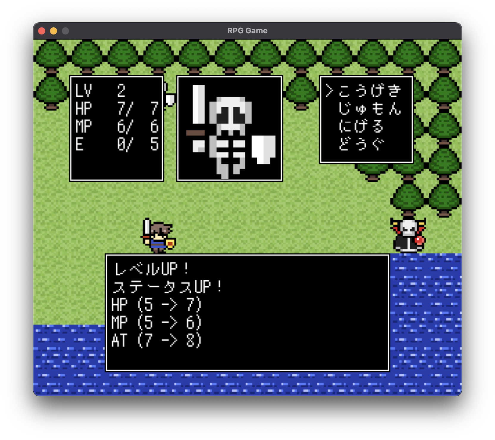

# Python RPG



pythonを用いてRPGゲームを実装しました．  
ChatCPTで修正を繰り返して作ろうと思っていましたが，人力の方が効率が良いので自分の手で修正しています．

[![Python][Python.js]][Python.link]

## Installation

```console
pip install pygame
```

## Usage

```console
python RPG.py

```

## 操作方法
| キー | 説明 |
| --- | --- |
| w | ↑ |
| s | ↓ |
| d | ← |
| a | → |
| n | 決定 |
| m | キャンセル |
| i | インベントリを開く |

## 使用素材

- 背景などの画像
    - [DOT ILLUST](https://dot-illust.net/)
- フォント
    - [「ノスタルドット（M+）」フォント](https://logotype.jp/nosutaru-dot.html)

<!-- MARKDOWN LINKS & IMAGES -->
[Python.js]: https://img.shields.io/badge/Python-3572A5?style=for-the-badge&logo=Python&logoColor=white
[Python.link]: https://www.python.org/